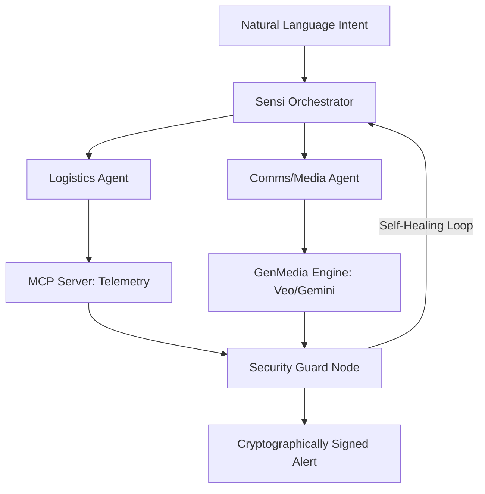

# Project Sensi: Global Hazard Monitor & Alert System

Project "Sensi" is a production-grade multi-agent system designed to safeguard human life and property from imminent natural and environmental hazards (e.g., Earthquakes and Heatwaves). Built for the Kaggle 5-Day AI Agents Capstone, it leverages Google ADK, MCP, and GenMedia to deliver high-accuracy hazard prediction and reliable response coordination.

## 🏗️ Life-Safety Architecture

Sensi utilizes a multi-layered topology to ensure mission-critical reliability:

1.  **Sensi Orchestrator (Topology Layer)**: Built with Google ADK. Coordinates specialized agents for Seismic and Thermal analysis.
2.  **Logistics Agent (MCP Interoperability)**: Accesses high-accuracy telemetry through a sandboxed MCP Server.
3.  **Comms Agent (Procedural Skills)**: Maps telemetry thresholds to multi-modal GenMedia (Gemini/Veo) to generate 1080p evacuation visuals and signed alerts.
4.  **Security Guard Node (Self-Healing Runtime)**: Monitors prediction scripts for errors, intercepts exceptions, and performs autonomous repair.

### 📂 Structural Layout
```text
sensi_workspace/
├── agents/
│   ├── orchestrator.py    # Core Multi-Agent Logic
│   └── guard_node.py      # Self-Healing Security Node
├── mcp_server/
│   └── server.py          # FastMCP Telemetry Server (Sandboxed)
├── skills/
│   └── broadcast_generation/
│       ├── SKILL.md       # Procedural Memory Documentation
│       ├── scripts/       # Transformation Logic
│       └── references/    # Safety SOPs
├── api.py                 # FastAPI Backend (Lovable Integration)
├── app.py                 # Gradio Crisis Command Center
└── notebook_cli.py        # Interactive Kaggle Notebook UI
```

### 🔄 System Flow


## 🛠️ Tool Stack

| Layer | Tool | Rationale |
| :--- | :--- | :--- |
| Orchestration | **Google ADK** | Professional multi-agent coordination. |
| Interoperability | **MCP (Model Context Protocol)** | Secure telemetry sandboxing. |
| Media Foundation | **Vertex AI GenMedia** | Production-grade 1080p visuals (Veo). |
| Self-Healing | **Security Guard Node** | Mission-critical runtime resilience. |
| Frontend | **React + Tailwind** | Modern, "Lovable" user interface. |

## 🚀 Reproduction

### 1. Prerequisites
```bash
pip install google-adk mcp pydantic python-dotenv fastapi uvicorn gradio
```

### 2. Launch the Crisis Command Center (Gradio)
```bash
python sensi_workspace/app.py
```

### 3. Launch the API Backend (Lovable)
```bash
uvicorn sensi_workspace.api:app --reload
```

## 🔐 Security & Reliability
- **Absolute Secrets Separation:** All keys are managed via `.env` and never hardcoded.
- **Sandboxed Telemetry:** No direct access to raw sensor networks; all data flows through validated MCP tools.
- **Self-Healing Runtime:** Autonomous error detection and code repair for 24/7 mission-critical uptime.

---
*Developed for the Kaggle 5-Day AI Agents: Intensive Vibe Coding Capstone Project.*
